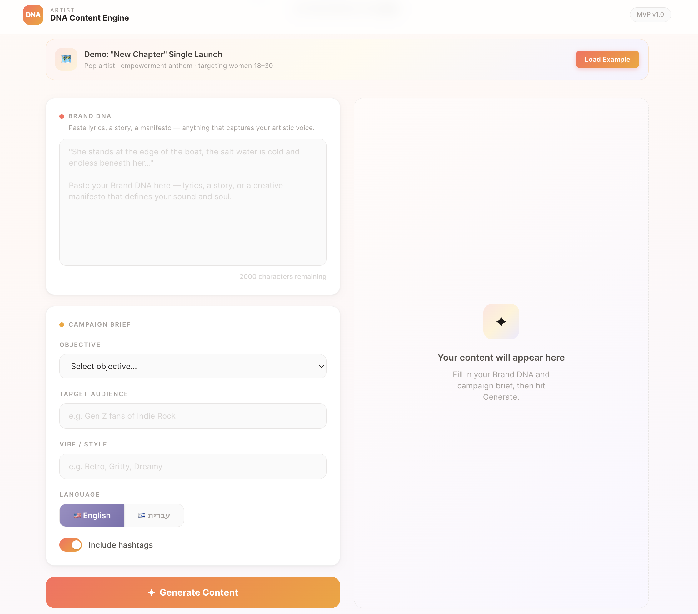
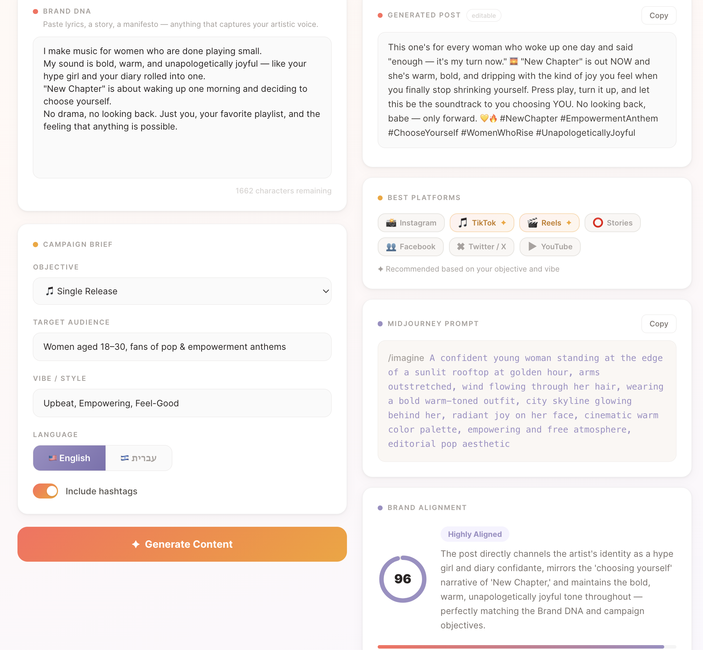
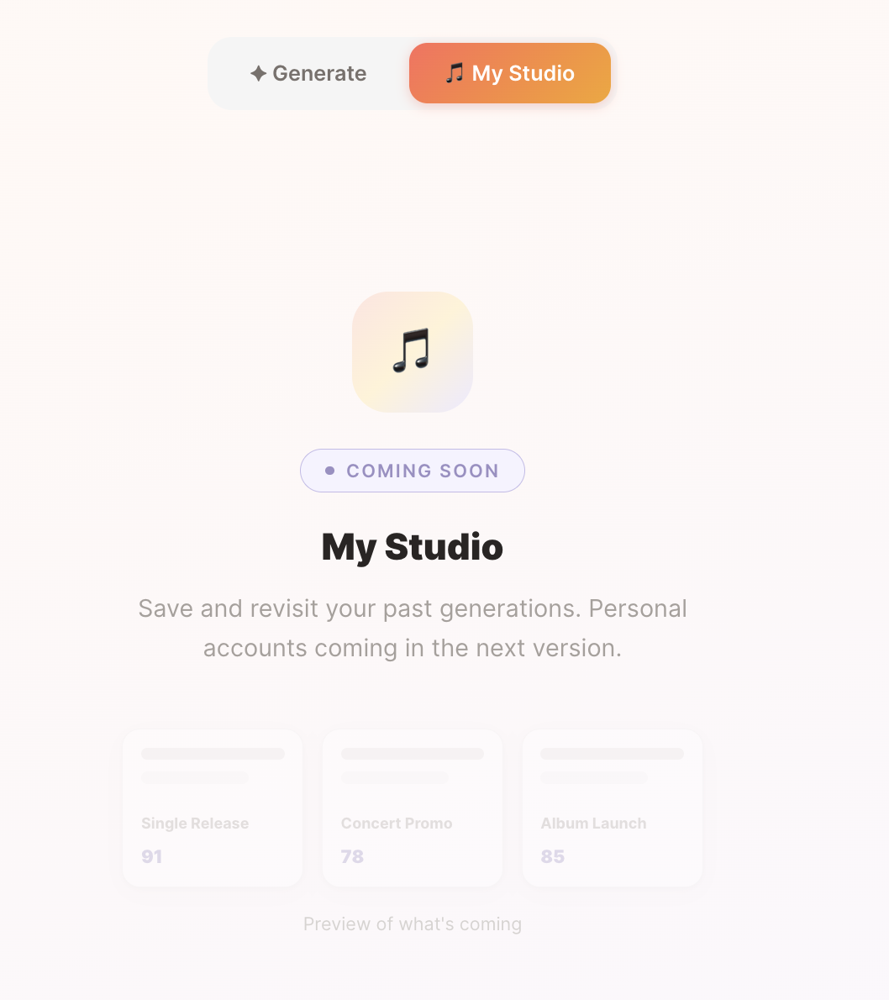

# 🎵 Artist DNA Content Engine

> AI-powered social media content generator that learns your unique artistic voice and creates on-brand posts, image prompts, and platform strategies — in seconds.


---

## Overview

### The Problem

Independent musicians and emerging artists dedicate most of their energy to the craft — writing, recording, performing. Marketing is an afterthought, not because it doesn't matter, but because it's genuinely hard.

Coming up with fresh, authentic social media content on a daily or weekly basis is mentally exhausting. Most artists default to the same patterns: a cropped album cover, a vague caption, a handful of generic hashtags. The result is content that doesn't reflect their true artistic voice — and fans can feel the disconnect.

Existing AI writing tools make this worse, not better. They generate polished, professional copy that sounds like everyone else. An artist who spent three years crafting a raw, vulnerable sound deserves more than a caption that could belong to any brand.

### The User

**Independent and emerging artists** who are active on social media but struggle to maintain a consistent, authentic content presence without sacrificing time they need for their creative work.

### The Solution

**Artist DNA Content Engine** solves this by grounding AI generation in the artist's own creative material — their lyrics, stories, and artistic voice — rather than a generic brief. The result is content that sounds unmistakably like *them*.

The artist pastes a piece of their creative DNA (lyrics, a story, a manifesto), defines a campaign goal, and receives a fully formed social post, a Midjourney image prompt for matching visuals, a platform recommendation based on their objective and vibe, and a Brand Alignment Score that measures how faithfully the output reflects their voice.

This MVP demonstrates a core product hypothesis: that AI-generated marketing content becomes significantly more valuable — and significantly more adopted — when it is anchored in the user's own creative identity rather than produced from a blank slate.

---

## Screenshots

> 📸 _Input panel — Brand DNA + Campaign Brief_



> 📸 _Output panel — Generated post, platform recommendations, Midjourney prompt, and Brand Alignment score_



> 📸 _My Studio — Coming Soon_



---

## Features

### Input
- **Brand DNA Box** — Paste lyrics, a story, or a creative manifesto that captures your artistic voice
- **Campaign Brief** — Set your objective (Album Launch, Single Release, Concert Promo, Merch Drop, Behind the Scenes), target audience, and vibe
- **Language Toggle** — Generate content in English or Hebrew
- **Hashtag Toggle** — Turn hashtags on or off before generating

### Output
- **Generated Post** — Fully editable caption, ready to copy and post
- **Platform Recommendations** — Instagram, TikTok, Reels, Stories, Facebook, Twitter/X, YouTube — with 1–2 recommended based on your objective and vibe
- **Midjourney Image Prompt** — A detailed visual prompt to create matching artwork
- **Brand Alignment Score** — A 0–100 score with reasoning that shows how well the content reflects your DNA

### UX
- One-click **demo example** pre-filled with a real campaign scenario
- Copy-to-clipboard on all output sections
- Clean, light creative-studio aesthetic with coral, gold, and lavender accents

---

## Tech Stack

| Layer | Technology |
|---|---|
| Framework | [Next.js 16](https://nextjs.org) (App Router) |
| Language | TypeScript 5 |
| Styling | Tailwind CSS v4 |
| AI | [Claude API](https://anthropic.com) via `@anthropic-ai/sdk` (claude-opus-4-6) |
| Database | [Supabase](https://supabase.com) (generation history) |
| Deployment | Vercel-ready |

---

## Getting Started

### 1. Clone the repo

```bash
git clone https://github.com/rachelyaron/artist-dna.git
cd artist-dna
npm install
```

### 2. Set up environment variables

Create a `.env.local` file in the root:

```env
# Anthropic — get from https://console.anthropic.com/settings/keys
ANTHROPIC_API_KEY=sk-ant-...

# Supabase — get from https://supabase.com → Project Settings → API
NEXT_PUBLIC_SUPABASE_URL=https://xxxxxxxxxxxx.supabase.co
SUPABASE_SERVICE_ROLE_KEY=eyJhbGci...
```

> **Note:** Supabase is optional. The app works without it — generations just won't be persisted.

### 3. Set up the database (optional)

Run `supabase_setup.sql` in your Supabase SQL Editor to create the `generations` table.

### 4. Run the development server

```bash
npm run dev
```

Open [http://localhost:3000](http://localhost:3000) in your browser.

---

## How It Works

```
User inputs Brand DNA + Campaign Brief
           │
           ▼
   POST /api/generate
           │
           ▼
  Claude API (claude-opus-4-6)
  ┌─────────────────────────────┐
  │ System: music marketing     │
  │         strategist persona  │
  │                             │
  │ User:   Brand DNA + brief   │
  │         → structured JSON   │
  └─────────────────────────────┘
           │
           ▼
  Parse response → persist to Supabase
           │
           ▼
  Render: post · platforms · image prompt · score
```

---

## Project Structure

```
artist-dna/
├── app/
│   ├── page.tsx              # Main UI (two-column layout)
│   ├── layout.tsx
│   ├── globals.css           # Design tokens & animations
│   └── api/generate/
│       └── route.ts          # Claude API + Supabase
├── components/
│   ├── Header.tsx
│   ├── CaseStudyBanner.tsx   # Demo example loader
│   ├── BriefForm.tsx         # Objective / audience / vibe / language / hashtags
│   └── OutputCard.tsx        # Post · platforms · image prompt · score
├── lib/
│   └── caseStudy.ts          # Pre-filled demo data
└── supabase_setup.sql        # DB schema
```

---

## Roadmap

- [ ] My Studio — Personal content history with user accounts
- [ ] Multi-language support beyond Hebrew/English
- [ ] Export to PDF / copy all outputs at once
- [ ] A/B post variants — generate 2–3 options per brief
- [ ] Tone calibration slider (Subtle ↔ Bold)

---

## Built By

**Rachel Yaron** — Product & Technology

[](https://github.com/rachelyaron)

---

_Powered by Claude AI · Artist DNA Content Engine MVP_
